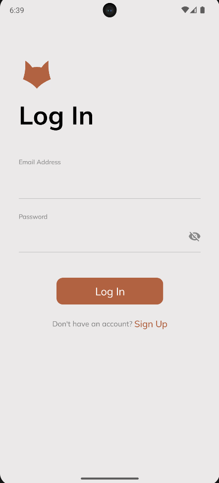
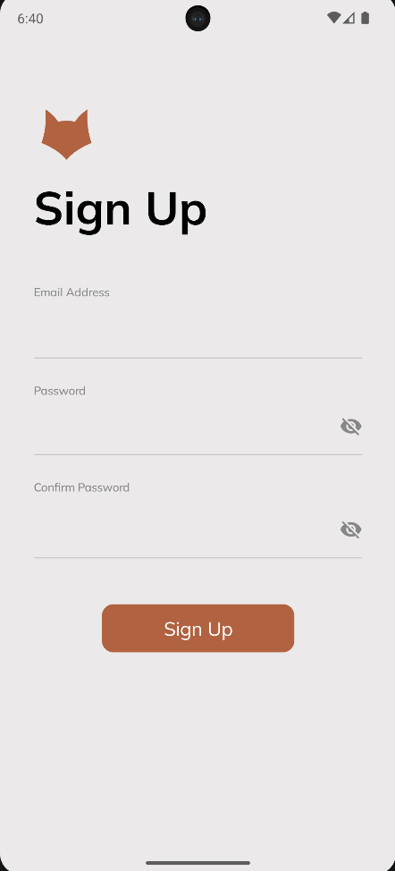
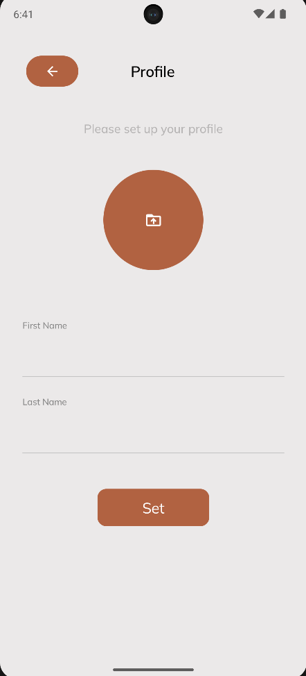
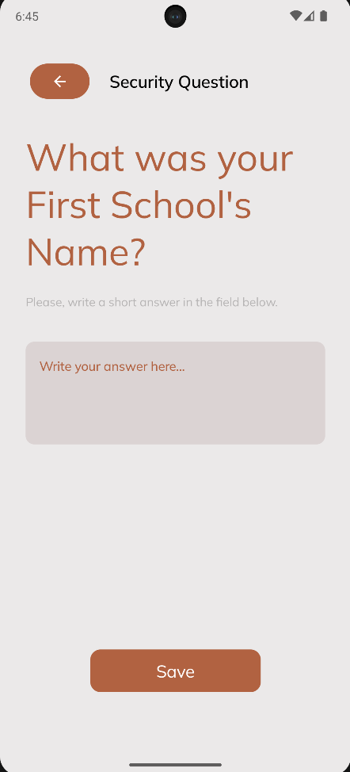
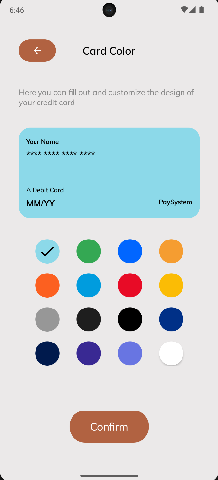
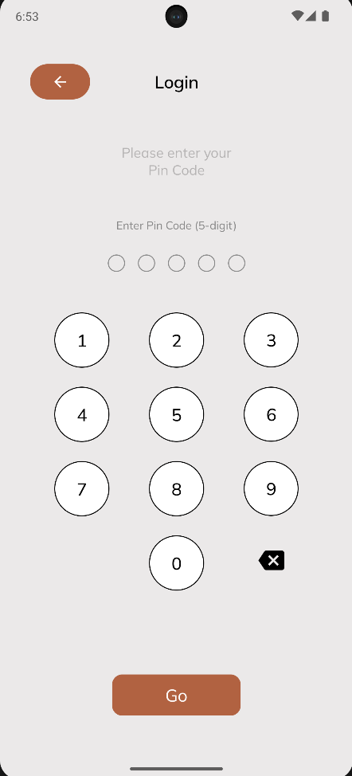
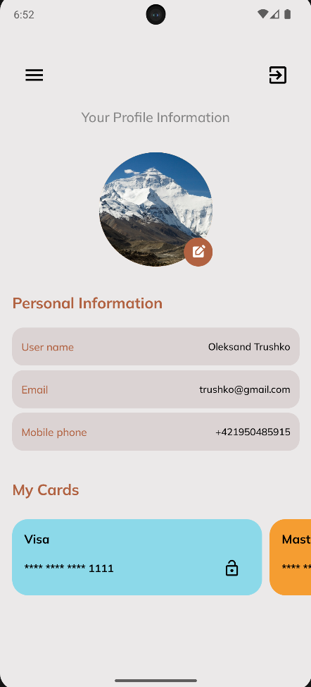
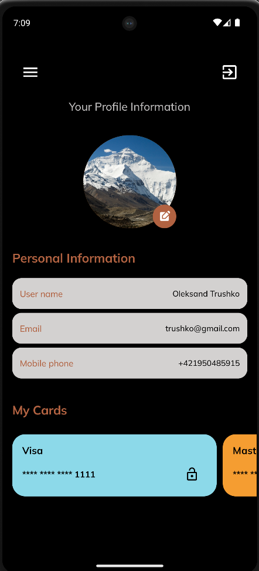
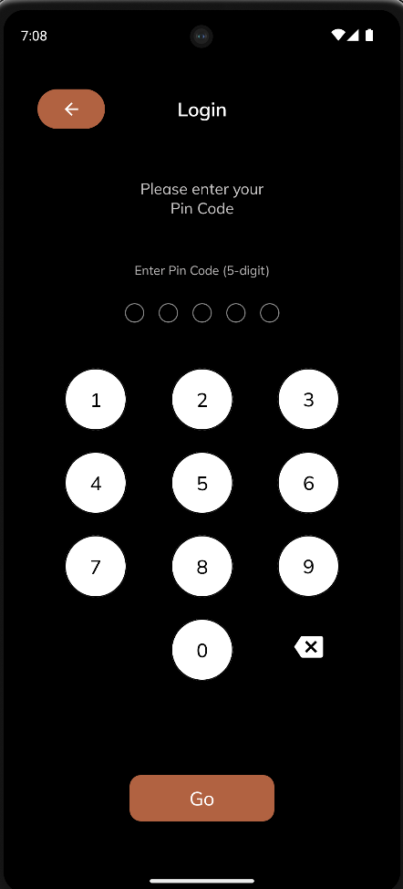

# BankCard

An app for creating and managing bank cards. Register, fill in your personal details, and create your virtual card by providing the number, cardholder name, expiration date, payment system, and also a password for locking/unlocking the card.

## Technology Stack

- **Programming Language**: [Kotlin](https://kotlinlang.org/)
- **Architecture Pattern**: MVI (Model-View-Intent) 
- **Dependency Injection**: [Hilt](https://developer.android.com/training/dependency-injection/hilt-android)
- **Asynchronous Programming**: [Kotlin Flow](https://kotlinlang.org/docs/flow.html), [Coroutines](https://kotlinlang.org/docs/coroutines-overview.html)
- **Database**: [SQLite](https://www.sqlite.org/index.html) (with [Room](https://developer.android.com/training/data-storage/room))
- **Navigation**: [Navigation component](https://developer.android.com/develop/ui/compose/navigation)
- **View Layer**: [Jetpack Compose](https://developer.android.com/compose)
- **Image loading**: [Coil](https://coil-kt.github.io/coil/compose/)

## Screenshots

### Authentication

  
  
  

### Profile Settings

  
  
  

### Card Settings

  
  
  

### Main Screen

  

### Dark theme

  
  
  

## Features
- **Secure user registration using SecureRandom for salt generation. Multi-step hashing algorithm for enhanced password security**
